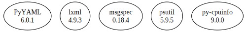

# Third Party Dependencies

<!--[[[fill sbom_sha256()]]]-->
The [SBOM in CycloneDX v1.4 JSON format](https://git.sr.ht/~sthagen/taksonomia/blob/default/sbom/cdx.json) with SHA256 checksum ([9024e094 ...](https://git.sr.ht/~sthagen/taksonomia/blob/default/sbom/cdx.json.sha256 "sha256:9024e094afab4d9afb62a4badb9b2401934745d80cf5118753010cf2cd63896a")).
<!--[[[end]]] (checksum: d98dbb85779394e0a468b5a3fda6a8f2)-->
## Licenses 

JSON files with complete license info of: [direct dependencies](direct-dependency-licenses.json) | [all dependencies](all-dependency-licenses.json)

### Direct Dependencies

<!--[[[fill direct_dependencies_table()]]]-->
| Name                                                  | Version                                             | License     | Author                | Description (from packaging data)                                                                        |
|:------------------------------------------------------|:----------------------------------------------------|:------------|:----------------------|:---------------------------------------------------------------------------------------------------------|
| [PyYAML](https://pyyaml.org/)                         | [6.0](https://pypi.org/project/PyYAML/6.0/)         | MIT License | Kirill Simonov        | YAML parser and emitter for Python                                                                       |
| [lxml](https://lxml.de/)                              | [4.9.2](https://pypi.org/project/lxml/4.9.2/)       | BSD License | lxml dev team         | Powerful and Pythonic XML processing library combining libxml2/libxslt with the ElementTree API.         |
| [msgspec](https://jcristharif.com/msgspec/)           | [0.16.0](https://pypi.org/project/msgspec/0.16.0/)  | BSD License | Jim Crist-Harif       | A fast serialization and validation library, with builtin support for JSON, MessagePack, YAML, and TOML. |
| [psutil](https://github.com/giampaolo/psutil)         | [5.9.5](https://pypi.org/project/psutil/5.9.5/)     | BSD License | Giampaolo Rodola      | Cross-platform lib for process and system monitoring in Python.                                          |
| [py-cpuinfo](https://github.com/workhorsy/py-cpuinfo) | [9.0.0](https://pypi.org/project/py-cpuinfo/9.0.0/) | MIT License | Matthew Brennan Jones | Get CPU info with pure Python                                                                            |
<!--[[[end]]] (checksum: a93f5fe16bc996856a7ed997a296231b)-->

### Indirect Dependencies

<!--[[[fill indirect_dependencies_table()]]]-->
| Name | Version | License | Author | Description (from packaging data) |
|:-----|:--------|:--------|:-------|:----------------------------------|
<!--[[[end]]] (checksum: 8a87b89207db0be2864af66f9266660c)-->

## Dependency Tree(s)

JSON file with the complete package dependency tree info of: [the full dependency tree](package-dependency-tree.json)

### Rendered SVG

Base graphviz file in dot format: [Trees of the direct dependencies](package-dependency-tree.dot.txt)



### Console Representation

<!--[[[fill dependency_tree_console_text()]]]-->
````console
lxml==4.9.2
msgspec==0.16.0
psutil==5.9.5
py-cpuinfo==9.0.0
PyYAML==6.0
````
<!--[[[end]]] (checksum: 1067c5742c2cae257393043a900a9d75)-->
