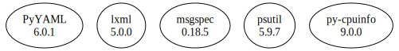

# Third Party Dependencies

<!--[[[fill sbom_sha256()]]]-->
The [SBOM in CycloneDX v1.4 JSON format](https://github.com/sthagen/pilli/blob/default/sbom.json) with SHA256 checksum ([a5894124 ...](https://raw.githubusercontent.com/sthagen/pilli/default/sbom.json.sha256 "sha256:a589412444f0ebc2c64be8115f16d1ea1f1fbcc5b164be22a171026fda517c2f")).
<!--[[[end]]] (checksum: e526481a878c237476510da7c159cee7)-->
## Licenses 

JSON files with complete license info of: [direct dependencies](direct-dependency-licenses.json) | [all dependencies](all-dependency-licenses.json)

### Direct Dependencies

<!--[[[fill direct_dependencies_table()]]]-->
| Name                                                  | Version                                             | License                              | Author                | Description (from packaging data)                                                                |
|:------------------------------------------------------|:----------------------------------------------------|:-------------------------------------|:----------------------|:-------------------------------------------------------------------------------------------------|
| [PyYAML](https://pyyaml.org/)                         | [6.0](https://pypi.org/project/PyYAML/6.0/)         | MIT License                          | Kirill Simonov        | YAML parser and emitter for Python                                                               |
| [lxml](https://lxml.de/)                              | [4.9.1](https://pypi.org/project/lxml/4.9.1/)       | BSD License                          | lxml dev team         | Powerful and Pythonic XML processing library combining libxml2/libxslt with the ElementTree API. |
| [orjson](https://github.com/ijl/orjson)               | [3.8.3](https://pypi.org/project/orjson/3.8.3/)     | Apache Software License; MIT License | ijl <ijl@mailbox.org> | Fast, correct Python JSON library supporting dataclasses, datetimes, and numpy                   |
| [psutil](https://github.com/giampaolo/psutil)         | [5.9.4](https://pypi.org/project/psutil/5.9.4/)     | BSD License                          | Giampaolo Rodola      | Cross-platform lib for process and system monitoring in Python.                                  |
| [py-cpuinfo](https://github.com/workhorsy/py-cpuinfo) | [9.0.0](https://pypi.org/project/py-cpuinfo/9.0.0/) | MIT License                          | Matthew Brennan Jones | Get CPU info with pure Python                                                                    |
<!--[[[end]]] (checksum: d73e90ff0687f65400d20b9c4240091f)-->

### Indirect Dependencies

<!--[[[fill indirect_dependencies_table()]]]-->
| Name                                          | Version                                        | License     | Author         | Description (from packaging data)         |
|:----------------------------------------------|:-----------------------------------------------|:------------|:---------------|:------------------------------------------|
| [click](https://palletsprojects.com/p/click/) | [8.1.3](https://pypi.org/project/click/8.1.3/) | BSD License | Armin Ronacher | Composable command line interface toolkit |
<!--[[[end]]] (checksum: dc3a866a7aa3332404bde3da87727cb9)-->

## Dependency Tree(s)

JSON file with the complete package dependency tree info of: [the full dependency tree](package-dependency-tree.json)

### Rendered SVG

Base graphviz file in dot format: [Trees of the direct dependencies](package-dependency-tree.dot.txt)



### Console Representation

<!--[[[fill dependency_tree_console_text()]]]-->
````console
lxml==4.9.1
orjson==3.8.3
psutil==5.9.4
py-cpuinfo==9.0.0
PyYAML==6.0
````
<!--[[[end]]] (checksum: e58a8159ddc2fb081f14ab711c454172)-->
